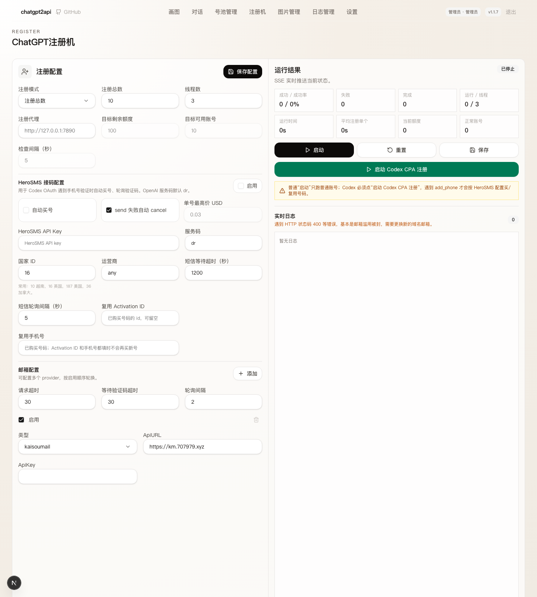

# KaisouMail 邮箱 Provider（#4bp4z）

> 当前有效规范以本文为准；实现覆盖与当前状态见 `./IMPLEMENTATION.md`，关键演进原因见 `./HISTORY.md`。

## 背景 / 问题陈述

当前注册流程通过可轮换的邮箱 provider 创建临时邮箱并轮询验证码。KaisouMail 提供 Bearer API Key 认证的邮箱创建和收件接口，需要作为新的 provider 接入，避免继续依赖用户手动选择其它邮箱服务。

## 目标 / 非目标

### Goals

- 新增 `kaisoumail` 邮箱 provider。
- 注册配置界面允许填写 `ApiURL` 和 `ApiKey`。
- 默认让 KaisouMail 从 active 域名中分配邮箱，不要求在本项目中配置域名。
- 轮询收件时优先复用 KaisouMail 返回的验证码识别结果。

### Non-goals

- 不在本项目中管理 KaisouMail 域名、用户、Passkey 或 API Key 生命周期。
- 不新增域名选择器。
- 不改变其它邮箱 provider 的行为。

## 范围（Scope）

### In scope

- 后端邮箱 provider 创建、轮询、错误处理和短重试。
- 注册配置 UI 的 provider 类型选项和字段可见性。
- 单元测试和基础前端构建验证。

### Out of scope

- 对 KaisouMail 管理员接口的接入。
- 真实 API Key 的端到端生产验证。

## 需求（Requirements）

### MUST

- `kaisoumail.api_base` 必须作为 API origin 使用并去掉尾部 `/`。
- `kaisoumail.api_key` 必须通过 `Authorization: Bearer <API_KEY>` 发送。
- 创建邮箱必须调用 `POST /api/mailboxes`，请求体包含 `localPart` 和 `expiresInMinutes: null`。
- 轮询邮件必须调用 `GET /api/messages?mailbox=<address>&since=<iso>`。
- 401、403、400 不重试；429 和 5xx 可短重试。
- 配置界面选择 `kaisoumail` 时只显示 `ApiURL` 和 `ApiKey`。

### SHOULD

- 列表消息的 `verification.code` 存在时直接使用。
- 没有列表验证码时读取 `GET /api/messages/:id` 详情，并复用通用验证码提取逻辑。

### COULD

- 后续可增加域名选择、TTL 设置或 API 连通性测试。

## 功能与行为规格（Functional/Behavior Spec）

### Core flows

- 管理员在注册配置中新增 provider，类型选 `kaisoumail`，填写 `ApiURL` 与 `ApiKey`。
- 注册任务创建邮箱时，provider 调用 KaisouMail 创建邮箱并记录 `address`、`mailbox_id`、`created_at`。
- 注册任务等待验证码时，provider 按邮箱地址和创建时间增量轮询消息。
- 找到验证码后，复用既有注册流程继续完成 OpenAI 账号注册。

### Edge cases / errors

- KaisouMail 鉴权失败或请求参数错误时，错误信息应包含 HTTP 状态码和响应摘要。
- 临时上游错误允许短重试，避免偶发 Cloudflare 或 API 抖动直接失败。
- KaisouMail 返回结构缺少 `address` 或消息详情不可解析时，应抛出明确 provider 错误。

## 接口契约（Interfaces & Contracts）

### 接口清单（Inventory）

| 接口（Name） | 类型（Kind） | 范围（Scope） | 变更（Change） | 契约文档（Contract Doc） | 负责人（Owner） | 使用方（Consumers） | 备注（Notes） |
| --- | --- | --- | --- | --- | --- | --- | --- |
| `mail.providers[].type=kaisoumail` | config | internal | New | None | chatgpt2api | 注册服务 / 注册配置 UI | 需要 `api_base` 和 `api_key` |
| KaisouMail Mailboxes API | HTTP API | external | New | None | KaisouMail | `KaisouMailProvider` | `POST /api/mailboxes` |
| KaisouMail Messages API | HTTP API | external | New | None | KaisouMail | `KaisouMailProvider` | `GET /api/messages` 与 `GET /api/messages/:id` |

### 契约文档（按 Kind 拆分）

- None

## 验收标准（Acceptance Criteria）

- Given 注册配置中存在启用的 `kaisoumail` provider
  When 注册流程创建邮箱
  Then 后端以 Bearer API Key 调用 KaisouMail 并返回可用于后续轮询的邮箱信息。

- Given KaisouMail 消息列表包含 `verification.code`
  When 注册流程等待验证码
  Then provider 直接返回该验证码。

- Given KaisouMail 消息列表没有验证码但详情正文包含验证码
  When provider 拉取消息详情
  Then provider 从详情正文中提取验证码。

- Given 注册配置页面选择 `kaisoumail`
  When 用户查看 provider 表单
  Then 页面只展示 `ApiURL` 和 `ApiKey`。

## 验收清单（Acceptance checklist）

- [x] 核心路径的长期行为已被明确描述。
- [x] 关键边界/错误场景已被覆盖。
- [x] 涉及的接口/契约已写清楚或明确为 `None`。
- [x] 相关验收条件已经可以用于实现与 review 对齐。

## 非功能性验收 / 质量门槛（Quality Gates）

### Testing

- Unit tests: provider 创建邮箱、验证码提取、详情 fallback、重试与不重试。
- Integration tests: None。
- E2E tests: None。

### UI / Storybook

- 仓库当前没有 Storybook；UI 证据使用本地 Next 预览页面。

### Quality checks

- `uv run python -m unittest test.test_cloudflare_temp_mail_provider`
- 新增 provider 单测。
- `cd web && bun run build`

## Visual Evidence

注册配置中选择 `kaisoumail` 后，仅展示 `ApiURL` 与 `ApiKey`。

## Related PRs

- None

## 风险 / 开放问题 / 假设（Risks, Open Questions, Assumptions）

- 假设 `ApiURL` 是 KaisouMail API origin，默认 `https://km.707979.xyz`。
- 假设 `ApiKey` 具备 mailbox 写入和 messages 读取权限。
- 假设创建邮箱时省略域名会由 KaisouMail 从 active 域名中分配。

## 参考（References）

- `https://km.707979.xyz/api-keys`
- `https://km.707979.xyz/api/meta`
